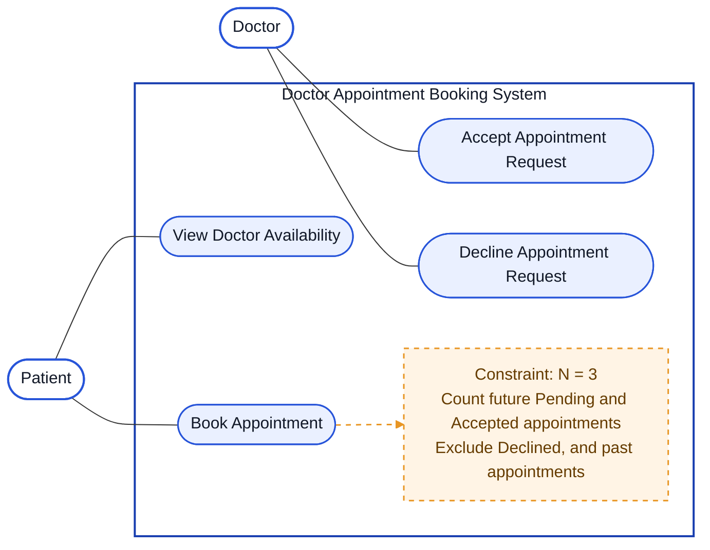

# Use Case Diagram — Doctor Appointment Booking System

```mermaid
flowchart LR
    Patient([Patient])
    Doctor([Doctor])

    subgraph System["Doctor Appointment Booking System"]
        direction TB

        UC1(["View Doctor Availability"])
        UC2(["Book Appointment"])
        UC3(["Accept Appointment Request"])
        UC4(["Decline Appointment Request"])

        Constraint["Constraint: N = 3<br/>Count future Pending and Accepted appointments<br/>Exclude Declined, and past appointments"]

        UC2 -.-> Constraint
    end

    Patient --- UC1
    Patient --- UC2
    Doctor --- UC3
    Doctor --- UC4

    classDef actor fill:#FFFFFF,stroke:#2855D9,color:#111827,stroke-width:2px
    classDef usecase fill:#EAF0FF,stroke:#2855D9,color:#111827,stroke-width:1.5px
    classDef constraint fill:#FFF4E5,stroke:#E89624,color:#663C00,stroke-width:1.5px,stroke-dasharray:5 5

    class Patient,Doctor actor
    class UC1,UC2,UC3,UC4 usecase
    class Constraint constraint

    style System fill:#FFFFFF,stroke:#173DAF,color:#111827,stroke-width:2px
    linkStyle 0 stroke:#E89624,stroke-width:1.5px,stroke-dasharray:5 5
```
